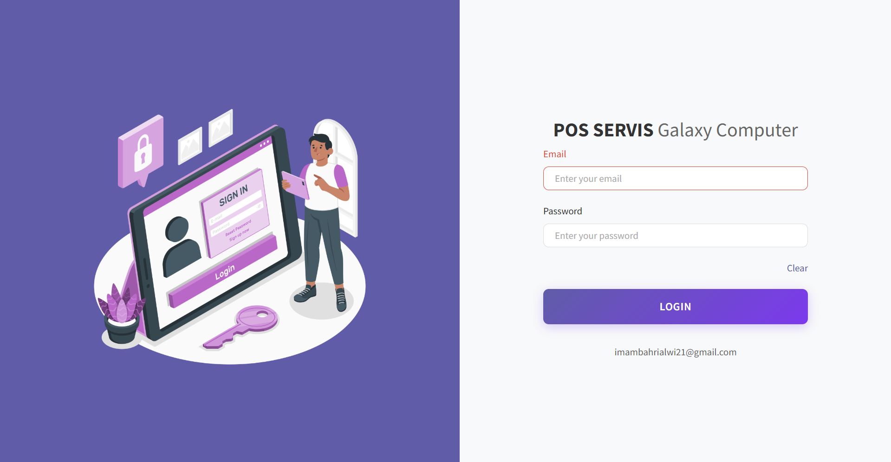
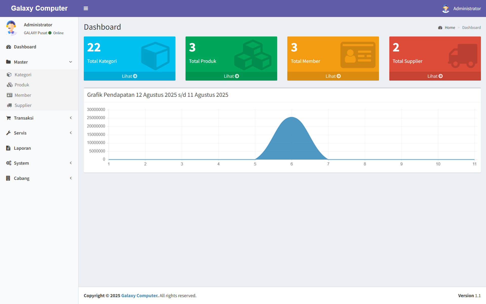
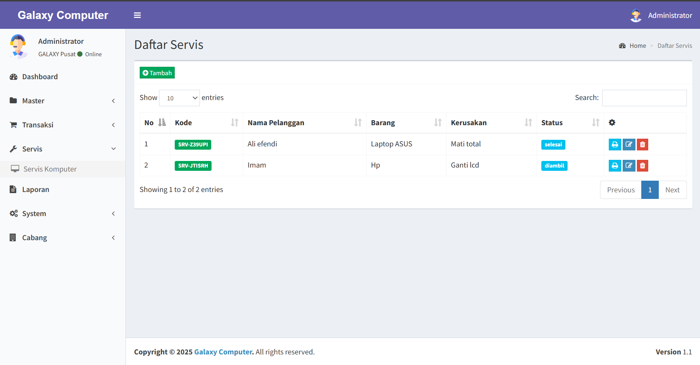
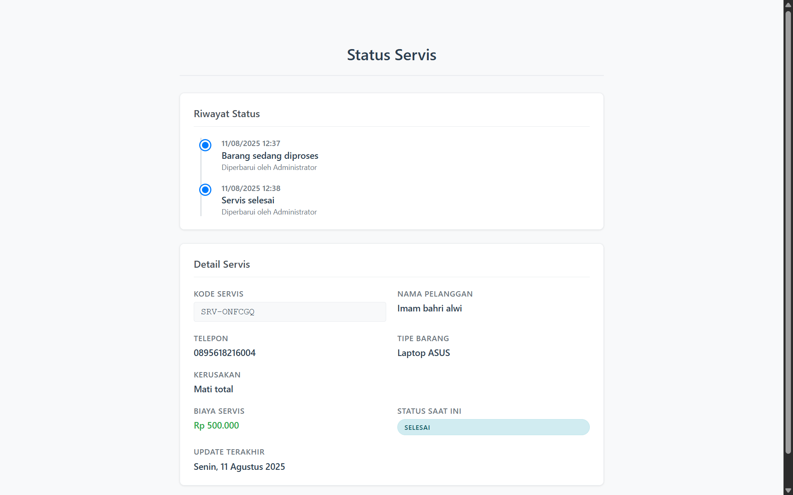
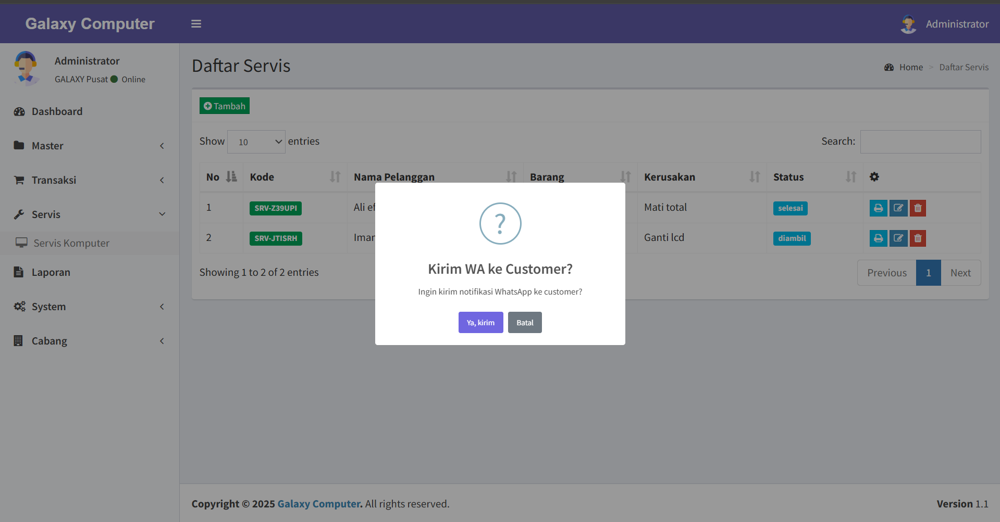

<p align="center">
    <a href="https://github.com/yourusername" target="_blank">
        
    </a>
</p>

## Tentang Aplikasi

Aplikasi **Point of Sales (POS)** ini digunakan untuk mengelola transaksi penjualan di toko, kasir, dan juga layanan servis.  
Dibangun menggunakan **Laravel v8.* ** dengan minimal **PHP v7.4**, aplikasi ini memiliki fitur manajemen produk, transaksi, laporan, serta manajemen user multi-role.  
Project ini merupakan pengembangan dari https://github.com/nursandiid/tutorial-membuat-aplikasi-point-of-sales dengan tambahan fitur, perbaikan bug, dan update UI/UX.

---

## Fitur Tambahan & Update

- **Manajemen Cabang**
  - Multi-cabang dengan user dan data terpisah.
- **Role Baru: Teknisi**
  - Khusus untuk mengelola pekerjaan servis.
- **Manajemen Service**
  - Tambah, edit, hapus data servis.
  - Update status servis (misal: proses, selesai, diambil).
  - Tracking status servis secara real-time.
  - Penghasilan dari servis otomatis terhitung di laporan.
  - **Kirim notifikasi WhatsApp ke customer** berisi status servis & link tracking.
- **Perbaikan Bug**
  - Fix error PDF saat cetak barcode member & produk.
- **Update UI**
  - Desain sidebar lebih modern.
  - Halaman login baru.
  - Desain nota diperbarui.
- **Deployment**
  - Aplikasi di-deploy ke AWS dan bisa diakses online.
  - **Demo**: [https://alwi.biz.id/login](https://alwi.biz.id/login)

---

## Akun Demo

**Administrator**
```
Email: admin@gmail.com
Password: 123
```

**Kasir**
```
Email: kasir1@gmail.com
Password: 123
```

**Teknisi**
```
Email: teknisi1@gmail.com
Password: 123
```

---

## Fitur Utama (Base + Update)

- **Manajemen Kategori Produk**
- **Manajemen Produk**
  - Multiple Delete
  - Cetak Barcode
- **Manajemen Member**
  - Cetak Kartu Member
- **Manajemen Supplier**
- **Transaksi**
  - Pengeluaran
  - Pembelian
  - Penjualan
- **Laporan**
  - Pendapatan/Laba Rugi (Harian, Bulanan, Custom)
  - Realtime update untuk layanan servis
- **Nota**
  - Nota Besar
  - Nota Kecil / Thermal
- **Manajemen User & Profil**
  - Multi-role: Administrator, Kasir, Teknisi
- **Pengaturan Toko**
  - Identitas, Desain Kartu Member, Diskon
- **Grafik ChartJS pada Dashboard**
- **Manajemen Cabang**
- **Manajemen Service & Tracking Status**

---

## Instalasi

#### Clone Repository
```bash
git clone [https://github.com/alwi2022/galaxy-pos.git](https://github.com/alwi2022/galaxy-pos.git)
cd galaxy-pos
```

#### Install Dependency
```bash
composer install
```

#### Copy & Konfigurasi `.env`
```bash
cp .env.example .env
```
Atur database di `.env`:
```env
DB_CONNECTION=mysql
DB_HOST=127.0.0.1
DB_PORT=3306
DB_DATABASE=pos_db
DB_USERNAME=root
DB_PASSWORD=
```

#### Generate Key
```bash
php artisan key:generate
```

#### Migrate & Seed Database
```bash
php artisan migrate --seed
```

#### Jalankan Server
```bash
php artisan serve
```

---

## Teknologi yang Digunakan
- Laravel 8.x
- Livewire
- Laravel Jetstream
- ChartJS
- DomPDF
- TCPDF
- Laravel DataTables
- AWS EC2 (Deployment)

---

## Screenshot

- **Halaman Login**  
  

- **Sidebar Baru**  
  

- **Manajemen Service**  
  

- **Tracking Status Servis**  
  

- **Kirim Notifikasi WhatsApp**  
  

---

**Demo Aplikasi:** [https://alwi.biz.id/login](https://alwi.biz.id/login)
